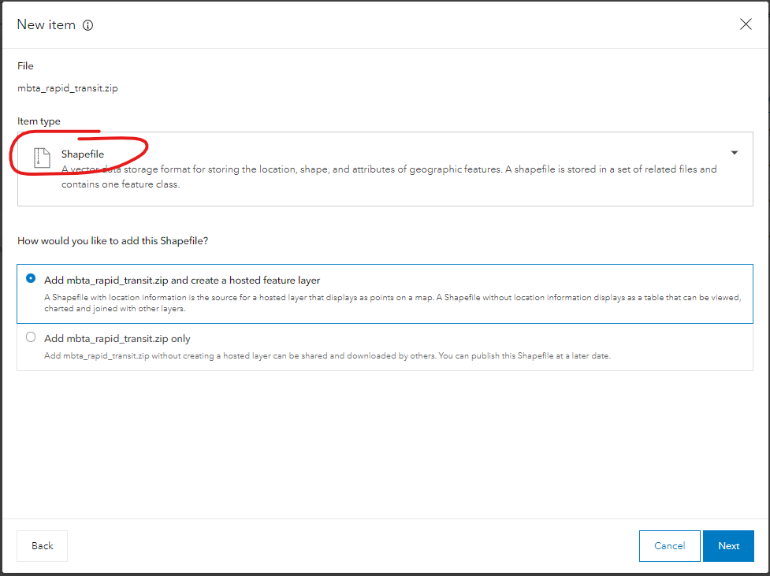

# Map Viewer Classic - Excercise 1
### Author: Dennis Milechin, Research Computing Services, Boston University

## Content
  * [Navigation](#navigation)
  * [Measure Tool](#measure-tool)
  * [Download Data](#download-data)
  * [Upload Shapefile to ArcGIS Online](#upload-shapefile-to-arcgis-online)
  * [Upload CSV File to ArcGIS Online](#upload-csv-file-to-arcgis-online)
  * [Add Layer](#add-layer)
  * [Save](#save)
  * [Share Web Map](#share-web-map)
  
## Navigation
**Now let's learn how to use the Map Viewer.**

1. Log onto ArcGIS Online portal. Remember your username has `_bucas` appended to it. (https://bucas.maps.arcgis.com/)
1. Top menu click on `Map`. This will load the map viewer.  
    
    

    **You might be asked if you want to try the Beta version of Map Viewer.  This tutorial will focus on the current stable release, so decline the request.**  
	
    **Let's review some basic navigation tools availabe in this environment.**

1. To pan, move the mouse to the map pane, left click and drag, and then release.
1. To zoom in, click the `+` button located at the top left of the map viewer.
1. To zoom out, click the `-` button.  
    
    

1. If you have a mouse with a scroll wheel or options, you can use that to zoom in and out as well.
1. To reset your view, click on the button that has the icon of a house, also known as the `default extent`, located between the `+` and `-` buttons.  
    
	
    
    **Near the top right, there is a `Find address or place` field where we can type in and address or location name.**  
    
	

1. Type in `Boston University` and hit the enter key on your keyboard.
    
    **The result is the web map will zoom onto the location of Boston University Charles River Campus.  We can save this view by saving it as a bookmark.**

1. To the left of the `Find address or place` search field is a button titled `Bookmarks`.  Click on the button and then `Add Bookmark`.  
    
	

1. Type in `Boston University` and hit enter on your keyboard.  This now saved this extent as a bookmark.
1. To test the book mark, click on the `Default Extent`, to return the view of the United States.  
    
	
	
1. Click on the `Bookmarks` button and then on `Boston University`.  This will zoom back to the extent of the bookmark.  
    
	

\[[top](#content)\]

## Measure Tool
**ArcGIS Online provides us with some tools to measure things on the map. Let's learn more about the measure tool.**

1. Click on the `Measures` button which is to the left of the `Bookmarks` button.  
    
	

    **There are three options for measuring tools: area, linear distance, and location.**

1. Select the `Area` button, which is located on the far left of the pop-up window.  
    
    

1. Move the mouse to the map, and left click to define the first vertex.
1. Move the mouse to another location and then left click to define the next vertex.
1. Continue the process to outline an area of interst.
1. When done, double left click to finalize the area, the results of the area is shown in the `Measure` pop-up window.  
    
	

1. You can change the units of the result in the drop down menu on the far right, where it currently might be selected to `Sq Miles`.
    
    

    **For `Distance` it is the the button next to `Area`.  Using this tool is nearly identical on how the area tool is used.  For `Location` tool (far right button) shows the coordinates for a clicked location and also the coordinates of the mouse, when it is hovering over the map.**

\[[top](#content)\]

## Download Data
**First we need to download the data we will use.  Please download the CSV file linked below.**
1. Click on the link below to download the tutorial zip files..
    [tutorial_files.zip](http://rcs.bu.edu/examples/gis/tutorials/arcgis_online_portal/tutorial_files.zip)
1. Unzip the zip files.

    **The zip file contains a directory called `mbta_rapid_transit` with a collection of files that represent a shapefile.  Additionally the zip file contains a CSV files called `mbta_subway_stations.csv`, which containts coordiante locations of MBTA subway stops and associated attributes.**

\[[top](#content)\]

## Upload Shapefile to ArcGIS Online

   **First let's upload the Shapefile.  We can only upload the shapefile if it is compressed into a zip file.**

1. Compress the `mbta_rapid_transit` directory into a zip file.  Use the method that is applicable to the operating system you are using.
1. Log onto ArcGIS Online portal. (https://bucas.maps.arcgis.com/)
1. At the top menu click on `Content` and `My Content`.  
    

1. Click on `Add Item` -> `From Your Computer`  
      

1. A new window will appear.  Click on `Your Device`.    
     
1. Find and select the zip file you just created. 
1. In the next window, under "Item type", "Shapefile" should be selected.  If not, use the drop down menu to select the "Shapefile".  

    

1. For question "How would you like to add this Shapefile"? Select "Add mbta_rapid_transit.zip and create a hosted feature layer".  

    

1. Click "Next" button.

1. In the title field, append your username at the end. This is needed because the hosted table needs to be unique within the BU origanization.  So we all cannot create a hosted table with the same name.
1. Select the folder you want to save this layer in.
1. Add tags, such as `Boston` and `MBTA`.  
    

1. Click "Save".

    **This will upload the file and take you to the description page for your new feature layer.**

    

\[[top](#content)\]

## Upload CSV File to ArcGIS Online

   **Next, let's upload the CSV files.**

1. Log onto ArcGIS Online portal. (https://bucas.maps.arcgis.com/)
1. At the top menu click on `Content` and `My Content`.  
    

1. Click on `Add Item` -> `From Your Computer`  
      

1. A new window will appear.  Click on "Your device" and find and select the CSV file that was downloaded.
      

1. For question "How would you like to add this CSV file"? Select "Add CSV and create a hosted feature layer".
    

1. Click "Next" button.

1. Here we can select what columns to import from our CSV file and also change the column names by updating the "Display name". 
     
1. No changes required, click "Next".
1. On this next page we need to specify that we want to use coordinates to locate the stations.  Click on the drop down menu for "Location settings".  
    
1. Select "Latitude and longitude".
1. We need to specify location fields.  For "Latitude" select `POINT_Y`.
1. For "Logitude" select `POINT_X`.  
    

1. Click "Next".
1. In the title field, append your username at the end. This is needed because the hosted table needs to be unique within the BU origanization.  So we all cannot create a hosted table with the same name.
1. Select the folder you want to save this layer in.
1. Add tags, such as `Boston` and `MBTA`.  
    

1. Click "Save".

    **This will upload the file and take you to the description page for your new feature layer.**

    

\[[top](#content)\]

## Add Layer
**Nots let's add the data we uploaded.**

1. Log onto ArcGIS Online portal. (https://bucas.maps.arcgis.com/)
1. Click on `Map` on the top menu.
1. Top left, click the `Add` button --> `Search for Layers`.  
    
	  
    
    **Left pane will change listing layers available in your `My Content` page.**
  
      

1. You should see the two layers we uploaded listed. Click on the `+` button on the bottom left of the layer listing to add them. 
    
	  
    
    **The layer appears in the map view pane.**
    
      

1. Click the back arrow located to the left of `My Favorites` to return to the content pane.  
    
	
1. Click on `Content` tab, which is to the right of `About`.   
    
	
    
    **This will show the layers that are available to be displayed on the map view.**

\[[top](#content)\]

## Save
**At this point it is good to save the map, so we don't lose our changes accidently.**

1. Upper mid-point of the window is a `Save` button.
    
	

1. Click on `Save` and then `Save As`.
1. A form will appear that you will need to fill out. Fill it out with the information below, but subsitute your username for my username where you see`_milechin`:
    
    
    
    **The map is now saved.  Periodically, click on the `Save` --> `Save` button to save any changes while progressing through this workshop.**

\[[top](#content)\]

## Share Web Map
**At this point you may want to share a map with someone else by giving them a url. Let's look at how this is done.**

1. Click n the `Share` button which is to the right of the `Save` button.
    
    
    **Before we can share the map, we need to change the permissions of who can view it.  The form contains several checkboxes for selecting with whom we want to share the map with.**
    * `Everyone (public)` will allow anyone in the world to see it.  
    * `Boston University College of Arts and Sciences` will restrict it to BU community who have an ArcGIS Online account.  
    * Finally, we can restrict access to a particular group.

1. Click the checkboxes for who you want to have access to this map. In this example I am only going to share it with the BU community by checking `Boston University College of Arts and Sciences`.
    
	

1. Further down the form there is a section `Link to this map` that contains a short URL you can share with others.
    

1. Click on `DONE`.

    **The permissions are now set and you can share the map with others.  You can also copy the link that is at the top of the browser and share that with others as well.**
    
    **Let's take a closer look permissions from `My Content` page.**

1. Navigate to `Content` --> `My Content`
    
    **Look at the permissions column for the items listed and you will see that the permission icon changed for the web map we shared.**
    

1. Click on the permissions icon.
    
    **A new window will appear which will allow you to modify permissions for that particular item.**
    
    

1. Once you chose the permission level you want for this item, `OK`.

\[[top](#content)\]