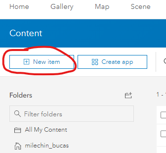
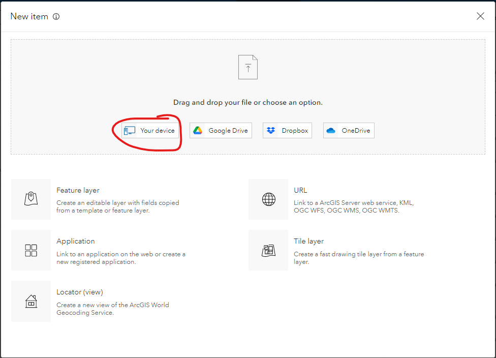
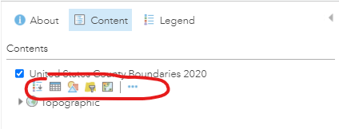
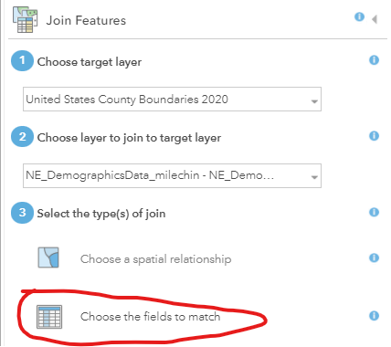
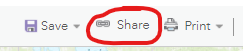
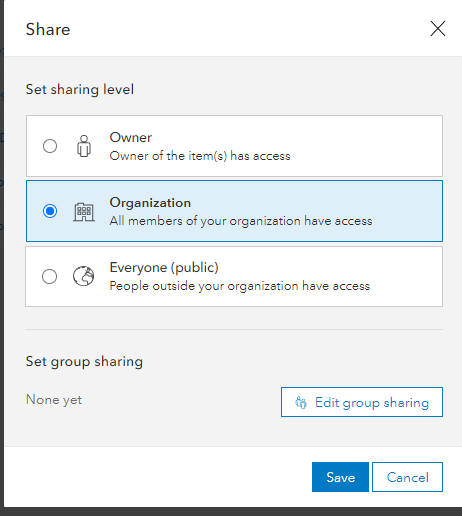

# Map Viewer Classic - Excercise 2
### Author: Dennis Milechin, Research Computing Services, Boston University
### Note: This document is provided as-is without any warranty

## Content
  * [Download Data](#download-data)
  * [Upload Data to ArcGIS Online](#upload-data-to-arcgis-online)
  * [Find County Boundaries Layer](#find-county-boundaries-layer)
  * [Open Map Viewer](#open-map-viewer)
  * [Add Layer](#add-layer)
  * [Attribute Table](#attribute-table)
  * [Add Hosted Table](#add-hosted-table)
  * [Save](#save)
  * [Join Table with County Layer](#join-table-with-county-layer)
  * [Look at "My Content"](#look-at-my-content)
  * [Symbolize % Frequent Physical Distress](#symbolize--frequent-physical-distress)
  * [Share Web Map](#share-web-map)
  

## Download Data
**First we need to download the data we will use.  Please download the CSV file linked below.**
1. Click on the link below.
    [NE_DemographicsData.csv](https://raw.githubusercontent.com/bu-rcs/bu-rcs.github.io/main/Bootcamp/Data/NE_DemographicsData.csv)
1. Right click on the page and select `Save As` or `Save Page As`
1. Save the file as `NE_DemographicsData.csv`, in an easy access location, like your desktop.

\[[top](#content)\]

## Upload Data to ArcGIS Online

1. Log onto ArcGIS Online portal. (https://bucas.maps.arcgis.com/)
1. At the top menu click on `Content` and `My Content`.  
    

1. Click on `Add Item` -> `From Your Computer`  
      

1. A new window will appear.  Click on "Your device" and find and select the CSV file that was downloaded.
      

1. For question "How would you like to add this CSV file"? Select "Add CSV and create a hosted feature layer".
    

1. Click "Next" button.

1. Here we can select what columns to import from our CSV file and also change the column names by updating the "Display name".  For this excercise we need to change the "type" for "FIPS" column from "Integer" to "String".
    

    **For Field Name `FIPS` we need to make sure this is a `String` Field Type in order to retain the leading zeros format.  This will be important for joining the CSV file with a county layer later.**

1. Click "Next"

1. ArcGIS ONline will assume the CSV file has spatial data, but it doesn't.  So we need to tell ArcGIS Online to import it as a table. Click on the drop down menu and select "None".
    

1. Your window should look like this:  
    

1. Click "Next".

1. In the title field, append your username at the end. This is needed because the hosted table needs to be unique within the BU organization.  So we all cannot create a hosted table with the same name.
1. Select the folder you want to save the file in.
1. Add tags, such as `Health Ranking Data`.
1. Type in a description, such as:
    > Demographic data for New England states only.  
1. Your form should look similiar to the snippet below:  
    

1. Click "Save" button.

    **After clicking save, it will automatically take you to the page that provides description of the hosted layer. At the moment all the fields are blank, so let's update the `Description` field.**

1. Under the `Description` section, click on `Edit` on the far right.  
    

1. Scroll further down, and on the right side, find the section `Credits (Attribution)`.  
    

1. Click on `Edit` and paste the following to give credit to the original generators of the data:  
    > University of Wisconsin Population Health Institute. County Health Rankings & Roadmaps 2019. www.countyhealthrankings.org.

1. Feel free to update other description options available on this page.  
    
    **Next, let's explore some of the blue tabs at the top of the page.**
    

1. Click on `Data`, to view the data that was just uploaded.
1. Click on `Usage` to see how frequently this data is used by you or others.
1. We will ignore `Settings` tab for now, as the default settings will satisfy our needs.

\[[top](#content)\]

## Find County Boundaries Layer

**In this section we will find a the United States County Layer that is already published on ArcGIS Online via the Living Atlas repository.  We will add this layer to our favorites so we can refer to it later.**
 
1. Log onto ArcGIS Online portal. (https://bucas.maps.arcgis.com/)
1. In the top menu click on `Content`.
1. In the Content submenu click on `Living Atlas` on the far right.
    
    

1. Search Living Atlas for USA County Boundary data.  In the search field type in `"United States County Boundaries 2020"` with quotes.
    
    

1. Click on `United States County Boundaries 2018` title.
    
    

1. If you cannot find this layer, click on the following link that will take you directly to the page:  [United States County Boundaries 2020](https://bucas.maps.arcgis.com/home/item.html?id=6a7ece25aa06439abb334188047b50fe)
    
    **Take a look at the description of the layer to learn more about this layer.**

1. Let's see what data it contains by clicking the `Data` tab in the blue sub-menu below your profile name.  
    
    

1. Click on Hamburger menu on the top right of table and click on `Show/Hide Columns`. 
     
    

    **We can see that there are additiona columns available.  We can enable them by click on the check box.**

1. Click on the `FIPS` checkbox to make it appear.  
    
    

    **The FIPS column is important because we will use this column to match the FIPS numbers in our CSV file and join the two data sets together.**

1. Click on the `Overview` tab to get back to the description.
1. We want to use this layer later, so mark it as favorite.  Under the preview image of the data, click on the star, to add it to our Favorites.  
    
    

1. Click on `Content`, in the top menu and then on `My Favorites` to see the list of items you had favorited.  
    
    

\[[top](#content)\]

## Open Map Viewer
**Now let's learn how to use the Map Viewer.**

1. Log onto ArcGIS Online portal. (https://bucas.maps.arcgis.com/)
1. Top menu click on `Map`. This will load the map viewer.  
    
    

1. If you are using the "Map Viewer Classic" it should look like this:
    

    If not, then in the top left corner, click on "Open in Map Viewer Classic" link to switch.

    

\[[top](#content)\]

## Add Layer
**Now let's add the `United States County Boundaries 2020` layer we had marked as our Favorite.**

1. Click on the `Default Extent` button to reset the mapview to the United States.
1. Top left, click the `Add` button --> `Search for Layers`.  
    
	  
    
    **Left pane will change listing layers available in your `My Content` page.**

1. Click on `My Content` --> `My Favorites`.   
      

1. The `United States County Boundaries 2020` layer is listed. Click on the `+` button on the bottom left of the layer listing. 
    
	  
    
    **The layer appears in the map view pane.**
    
      

1. Click the back arrow located to the left of `My Favorites` to return to the content pane.  
    
	
1. Click on `Content` tab, which is to the right of `About`.   
    
	
    
    **This will show the layers that are available to be displayed on the map view.**

1. Click on the checkbox next to the `United States County Boundaries 2020` to toggle the visibility of the layer off and on.  
    
	

1. Click on `Legend` tab, which is to the right of `Content`.   
    
	
    
    **This pane shows the layer name and how that layer is symbolized in the map.** 
    
    

1. Return to Content tab by clicking `Content`. 

\[[top](#content)\]

## Attribute Table
**Let's explore the attribute data in this layer.**

1. Zoom into the map and then move a mouse over a county and click on it.
    
    **This will generate a pop-up window.  In this pop-up window it will list the data associated with the county.**
    
    

1. Click on other counties to explore the data associated with the other counties.
    
    **To view the all the features and attributes we need to open the attribute table.**

1. Hover over the `United States County Boundaries 2020` layer and you will see icons appear below the layer name.
    
	

1. Click on the `Show Table` icon.
    
	
    
    **This will make the attribute table appear below the map viewer.**

    

1. You can sort the columns by clicking on the field name and selecting one of the sort options.
    
	

1. Click on the `2020 Total Population` field name and then click `Statistics` to see the statistics of the column.
1. Click on a row in the attribute table to highlight it.
    
	

1. Then click on the hamburger button at the top right of the attribute table and select `Center on Selection`.
    
	
    
    **This will zoom the map viewer to the center of the selected feature.  You can select multiple features in the attribute table by holding down the `CTRL` key on your keyboard while clicking the rows.**

\[[top](#content)\]

## Add Hosted Table
**The next step is to add the CSV data we uploaded to ArcGIS Online earlier.**

1. Just like adding the `United States County Boundary` layer, click on `Add` --> `Search for Layer`
1. Make sure `My Content` is selected at the top.
    
	

1. The CSV data we apploaded earlier should no be visible.  Click on the `+` symbol to add the table to our map.
    
	

1. Click on the back arrow at the top of the pane to return to the `Content` page.
    
    **The data is added as a table.  Nothing will appear on the screen because this data has no spatial information that would allow ArcGIS Online to plot this data on the map.  To plot data on the map we either need coordinates or addresses.  This is excercise we will join this data with the US County Boundaries layer we had found.**

1. Hover over the table layer you just imported and click on the `Show Table` icon.
1. Take a look at the table and confirm this is the same data as the CSV file.

\[[top](#content)\]

## Save
**At this point it is good to save the map, so we don't lose our changes accidently.**

1. Upper mid-point of the window is a `Save` button.
    
	

1. Click on `Save` and then `Save As`.
1. A form will appear that you will need to fill out. Fill it out with the information below, but subsitute your username for my username where you see`_milechin`:
    
    
    
    **The map is now saved.  Periodically, click on the `Save` --> `Save` button to save any changes while progressing through this workshop.**

\[[top](#content)\]

## Join Table with County Layer

**Now let's join the table data we have with the US County Boundary layer, so we can plot the CSV data on the map.**

1. Click on the `Analysis` button near the top of the page, to the right of `Basemap`.
    
	
    
    **The pane will appear and listing categories of analysis that can be done in ArcGIS Online.  We are only going to perform a `join` operation in this workshop.**

1. Click on `Summarize Data` to expand the list of tools available.
1. Click on `Join Features`.
    
	
     
    **A form will appear.  We need to fill out the form to tell the tool what layers we want to join and how we are going to join them.  Remeber that both the US County Boundaries data and the CSV file have a FIPS code, which we will use as the key to join the two data sets.**

1. For `1 Choose target Layer` enter `United States County Boundaries 2020` and for `2 Choose layer to join to target layer` select the CSV layer `NE DemographicsData_<username>`.

1. For item 3, click on `Choose the fields to match`.
    
	

1. Then from the two drop down menus, select `FIPS` field as the joining field.
    
    

1. Make sure section 4 `Choose join operation` looks like the snippet below:
    
    

1. Use the following name for section `5 Result layer name`:
    
	> Join_NE_Deomgraphics_Data_\<username\>

1.  Further down, uncheck the box for `Use current map extent`.  This will prevent only data that is currently visible in the map view to be considered in the join.
    
    **Your form should look similiar to the snippet below**
    
    
    
	**Before we run the analysis, we should check how much "credit" this analysis will consume.**

1. Click on the `Show Credits` link that is to the right of the `Use current map extent` checkbox.
    
	
    
    **A window will appear and provide a summary of the credits that will be used.  In this example 2.724 credits will be used.**
    
	

1. Click `X` in the window to close it.
1. Now click the `RUN ANALYSIS` button at the bottom of the pane.
    
    **Depending how large the datasets are, this can take a while to process.  You can still do other things within ArcGIS Online, while you wait for the analysis to complete.**
    
    **Once the analysis is complete, a new layer will be added to the map `Content` pane with the name we had chosen for the layer in the form, `Join_NE_Deomgraphics_Data_<username>`**
	
    
    
    **Let's zoom to the extent of the new layer if ArcGIS Online did not do it for us automatically.**

1. Hover over the new layer, and click on the three dots `...`, then click on `Zoom to`.
    
	

1. Click on `Legend` to see which symbology is being used for the new layer.
    
	
    
    **In this example the color is blue for the new layer and we see only the New England states are shown.  Only New England states are shown because the CSV file only had New England states and we indicated in the section 4 of the form to `Join one on one`, which would remove any counties which were not found in the CSV file.**

1. Go back to Content pane by clicking `Content`.
1. Toggle off the visibility of `United States County Boundaries 2020` layer by clicking the checkbox next to the layer name.
1. To confirm the data joined properly, hover over the new layer and click on the `Show table` button.
    
    **Take a look at the fields of the attribute table. You should see the fields from the `United States County Boundaries 2020` layer and also from the CSV data.**

1. Save the map.

    **We are now done with this web map for this session.  Next, we will create a new web map and import a dataset that I had already prepared for this session.**

\[[top](#content)\]

## Look at My Content

**Let's navigate back to `My Content` page and see what new items were created.**

1. Top left of the page, click on `Home` --> `Content`
    
	

1. Make sure the `My Content` tab is selected at the top.  Navigate to the directory where you saved the layers for this project.
    
    **In My Content, you should now see two additional items. A Web Map, which is the web map we just created, and a Feature Layer, which is the joined data layer we also just created.**
    
    

1. Click on the Web Map link `NE Demographics Working - <username>`.
    
    **This will display the information page for this web map.  Just like when we updated the information page for the CSV data we uploaded, we can do the same thing here. A similiar description page is also available for the Feature Layer we just created.**

1. Top right, click the `Open in Map Viewer` button.
    
	
    
    **This action will open the Web Map we just created.**

\[[top](#content)\]

### Symbolize % Frequent Physical Distress
**Our next task is to symbolize the data using the attribute table.  We will only focus symbolizing by range of value in this session.**

1. Navigate to the directory where you saved your web map and click on the link for the Web Map.  
	

1. Click on `Open in Map Viewer Classic`.  
    

1. The web map should open.  Click on `Content` to view the layers.
1. Let's remove the original county boundary layers.  Hover over `United States County Boundaries 2020` layer to see the additional menu items.
1. Click on the `...` icon.
1. Click on `Remove`  
    
1. You will be prompted to confirm if you want to remove the layer.  Click `YES, REMOVE LAYER`.

1. Hover over the `USA Demographics` layer and click on the `Show Table` button.
1. Find the `% Frequent Physical Distress` field.  This is the field we will use to symbolize this layer.
1. Hover over the `USA Demographics` layer and click on the `Change Style` button.
    
	

1. For `Choose an attribute to show` drop down menu select the `% Frequent Physical Distress` attribute.
1. Leave the rest of the options default, so the form should look like this:
    
	

1. Click `DONE`, at the bottom of the page.
    
    **With the symbology applied your map should look similiar to the snippet below.**
    
	
    
    **The layer name we currently have is not that informative, let's change it to the name of the attribute field we used to symbolize the data.**

1. Hover the mouse over the joined layer we had created, and click on the three dots `...` and then `Rename`.
    
	

1. In the new window type in `% Frequent Physical Distress` and click `OK`.
    
	
    
    **The layer name now reflects the sybmolized data in the map.**

1. This is a good time to save the map.

\[[top](#content)\]

## Share Web Map
**At this point you may want to share a map with someone else by giving them a url. Let's look at how this is done.**

1. Click n the `Share` button which is to the right of the `Save` button.  
    
    
    **Before we can share the map, we need to change the permissions of who can view it.  The form contains several checkboxes for selecting with whom we want to share the map with.**
    * `Everyone (public)` will allow anyone in the world to see it.  
    * `Boston University College of Arts and Sciences` will restrict it to BU community who have an ArcGIS Online account.  
    * Finally, we can restrict access to a particular group.

1. Click the checkboxes for who you want to have access to this map. In this example I am only going to share it with the BU community by checking `Boston University College of Arts and Sciences`.
    
	

1. Further down the form there is a section `Link to this map` that contains a short URL you can share with others.
    

1. Click on `DONE`.

    **The permissions are now set and you can share the map with others.  You can also copy the link that is at the top of the browser and share that with others as well.**
    
    **Let's take a closer look permissions from `My Content` page.**

1. Navigate to `Content` --> `My Content`.
1. Then navigate to your working directory for this project.
    
    **Look at the permissions column for the items listed and you will see that the permission icon changed for the web map we shared.**
    
	

1. Click on the permissions icon.
    
    **A new window will appear which will allow you to modify permissions for that particular item.**
    
    

1. Once you chose the permission level you want for this item, `OK`.

    **Take note that the "joined" layer we created has a permission of "Owner", which means only you have access to it.  When we changed permissions for the Web Map to be more public, this does not apply to the feature layer it is using.  So users who connect to the Web Map will not see the layer load.  You will also need to change the permission of the feature layer in order for it to load properly for folks who are viewing your web map.**

\[[top](#content)\]